# LCDGlance

**Monitor de sistema, panel de agentes y mascotas animadas** para el **LCD monocromo
160×43** y la **iluminación RGB** del teclado Logitech **G510**, sobre Logitech Gaming
Software (LGS 8.57).

> Una pantalla retro sci-fi con nivel de poder (PL), scouter interactivo y tres
> mascotas pixel-art dibujadas a mano — una por cada fuente que vigila.

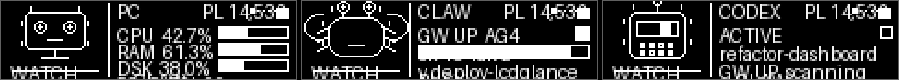

---

## Vista general

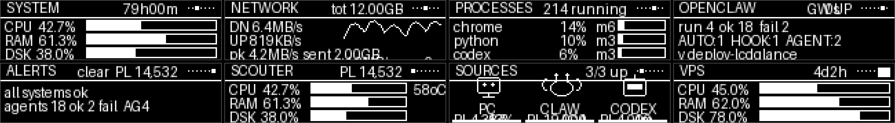

LCDGlance convierte el LCD del G510 (monocromo, 1-bit) en un panel de control vivo:

- **Tres fuentes vigiladas** — tu PC, el gateway OpenClaw y Codex — cada una con su
  propia mascota animada y su color RGB.
- **Nivel de poder (PL)** estilo *scouter* que sintetiza CPU, RAM, agentes activos y
  descargas en un único número.
- **Auto-foco**: si un agente termina o empieza una descarga, el panel salta solo a la
  escena relevante y vuelve a tu página.
- **7–8 páginas** de datos (ver abajo) + overlay de **Download** y **Scouter**.

---

## Mascotas

Cada fuente tiene su propio personaje dibujado a mano (no texto), con animaciones
independientes:

| Mascota | Fuente | Dibujo | Color RGB |
|---|---|---|---|
| **CLAW** | OpenClaw | cangrejo: caparazón, pinzas, patas, ojos en tallos | cian |
| **CODEX** | Codex (`~/.codex`) | robot: antena con LED, visor con escáner, boca de rejilla | verde |
| **PC** | tu equipo | monitor con cara y peana | azul |

**Animaciones** (por mascota):

- Respiración vertical suave en reposo, rebote enérgico cuando está ocupada, temblor
  frenético en alarma.
- Parpadeo cada 2–4 s y mirada de reojo aleatoria.
- Destellos de energía **pulsantes** que radian del cuerpo mientras la fuente trabaja.
- LED intermitente de antena (CODEX) y barrido del visor.

La mascota **destacada** es la del agente ocupado (o OpenClaw si no hay ninguno), y su
color tiñe el teclado RGB.

---

## Páginas

| # | Página | Contenido | Captura |
|---|---|---|---|
| 1 | **Mascot** | mascota + panel detallado por fuente (B3 cicla fuente) | 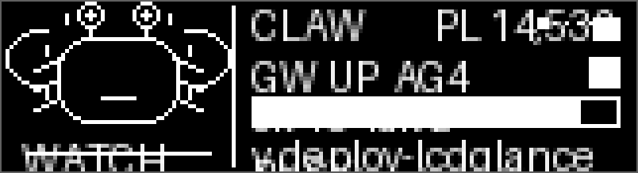 |
| 2 | **Sources** | PC / CLAW / CODEX con PL, mini-mascotas y barras de actividad | 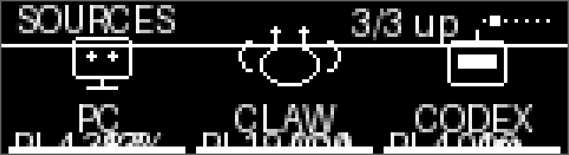 |
| 3 | **System** | CPU / RAM / disco + temperatura + frecuencia + memoria + top proceso | 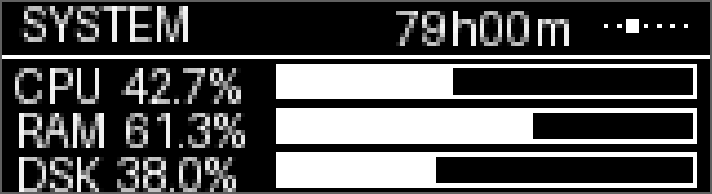 |
| 4 | **Network** | subida/bajada + pico + sparkline con escala | 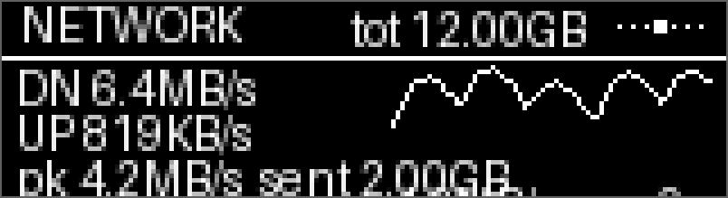 |
| 5 | **Procs** | procesos top por CPU y memoria | 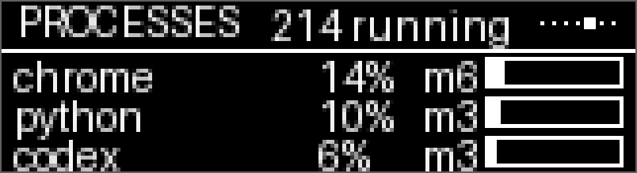 |
| 6 | **OpenClaw** | tipos de agentes + gateway + ratio ok/fail + último trabajo | 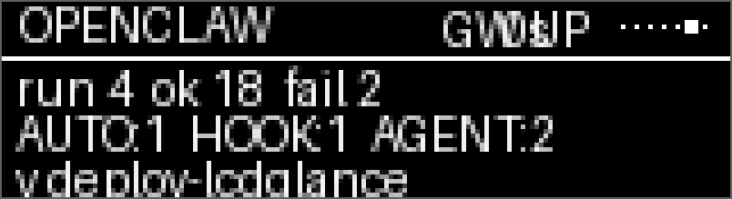 |
| 7 | **Alerts** | scouter con PL + alertas de sistema y agentes | 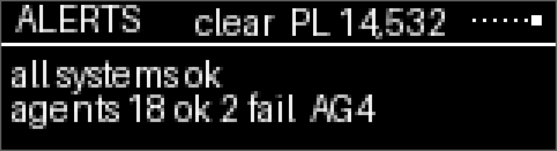 |
| 8 | **VPS** | servidor remoto SSH (si se configura `vps_config.json`) | 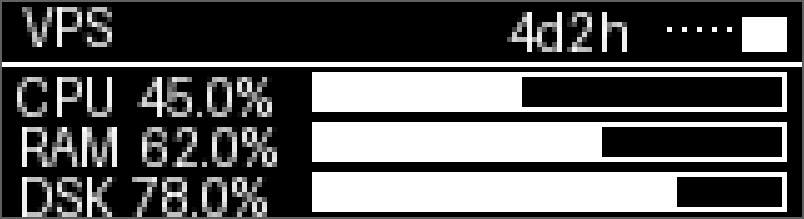 |
| ★ | **Download** | aparece **solo** con una descarga real | 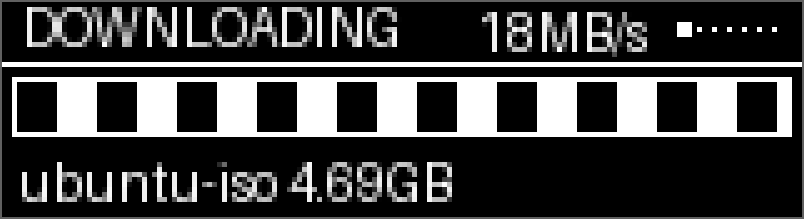 |
| ◈ | **Scouter** | overlay completo (B3) | 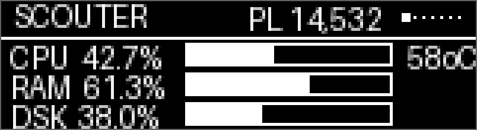 |

### Alertas activas

Cuando hay problemas la página Alerts pasa de "clear" a una lista con iconos de
severidad:

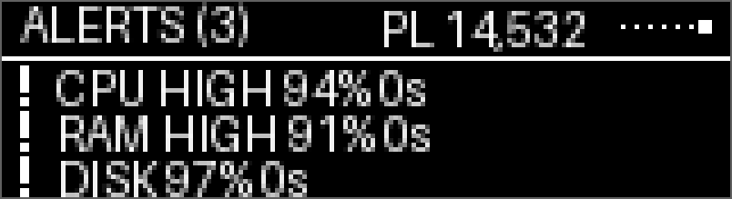

### Scouter (B3)

El **scouter** es un overlay a pantalla completa con lectura tipo Dragon Ball:
nivel de poder (PL), barras CPU/RAM/disco, temperatura, frecuencia, gateway, agentes
activos, Codex y velocidad de red.


---

## Botones

Toque corto vs. **mantener pulsado** (~0,6 s) — cada botón tiene dos funciones:

| Botón | Toque corto | Mantener pulsado |
|---|---|---|
| **B1** | Página anterior | Saltar a la 1ª página |
| **B2** | Página siguiente | Saltar a la última página |
| **B3** | Ciclar fuente (en Mascot) · scouter 8 s (otras páginas) | Scouter + refresco forzado de OpenClaw (10 s) |
| **B4** | Flash blanco + toggle alerta RGB | Toggle atenuación nocturna RGB |

**Auto-foco** — sin tocar nada:

- Un agente termina → salta a su mascota reaccionando ~8 s.
- Una descarga empieza → vista Download; al acabar, vuelve a tu página.

**Indicador de página**: puntos en la esquina superior derecha (el relleno = actual).

---

## RGB

Motor por prioridad, con respiración y atenuación nocturna automática (23:00–08:00 al
35 %) más overrive manual por **B4 mantenido**:

```
alerta manual > agente falló > agente OK > descarga > agentes activos
> CPU>90 % > RAM>90 % > disco>95 % > color de la mascota activa
```

---

## Instalación

1. Copia la carpeta a `C:\Users\<usuario>\lcdglance\`.

2. Normaliza la config de LGS (deja solo el applet correcto), **con LGS cerrado**:

   ```bat
   python configure.py
   ```

3. Arranca la aplicación desacoplada:

   ```bat
   python launch_detached.py
   ```

**Auto-arranque**: copia `start_lcdglance.vbs` a
`%APPDATA%\Microsoft\Windows\Start Menu\Programs\Startup\`.

> Requisitos: Windows + Logitech Gaming Software 8.57, Python 3.10+ y las librerías
> `pillow` y `psutil`. Para OpenClaw/Codex necesitas la sonda `lcd-probe` en WSL.

---

## Ficheros

```
lcdglance.py         aplicación principal
launch_detached.py   lanzador desacoplado (pythonw + DETACHED_PROCESS)
configure.py         normaliza la config de applets de LGS
configure_keys.py    configuración de colores RGB por tecla
preview.py           renderiza páginas/mascotas a PNG para revisar sin teclado
vps_config.json      configuración del VPS remoto (opcional)
start_lcdglance.vbs  auto-arranque (copiar a Startup)
restart.bat          reinicia la aplicación
restart_lgs.bat      reinicia LGS + la aplicación
```

---

## Fuentes de datos

- **PC**: `psutil` (CPU, RAM, disco, red, procesos). Caché amortiguado: contadores
  baratos cada 1 s, escaneo de procesos cada 3 s **en un hilo aparte**.
- **OpenClaw**: sonda `lcd-probe` (WSL) que ejecuta `openclaw tasks --json` sobre
  **todos** los runtimes y devuelve solo líneas compactas. Mirar solo `subagent` era el
  error: hay 9 tareas de ese tipo frente a ~700 de `cli` y ~690 de `cron`.
- **Codex**: `stat` de `~/.codex/logs_2.sqlite` + sesión más reciente en `~/.codex/sessions`.
- **VPS**: comandos estándar de Linux por SSH (sin instalar nada en el servidor).

---

## Reglas de alerta

| Evento | Reacción |
|---|---|
| Subagente termina (OK o fallo) | flash RGB + salto a la mascota 8 s |
| Automatización (`cron`) **no exitosa** | flash RGB + salto a la mascota |
| Automatización correcta (heartbeat) | solo se lista en Alerts (evita ruido) |
| Tareas `cli` | excluidas: son nuestras propias llamadas `exec` |
| Descarga real detectada | vista Download automática |

---

## Página VPS (SSH remoto)

La página 8 muestra estadísticas de un servidor remoto vía SSH. No instala nada en el
VPS: ejecuta `/proc/loadavg`, `free`, `df`, `uptime` y `ps` por SSH.

Edita `vps_config.json`:

```json
{
  "host": "tu-servidor.com",
  "user": "root",
  "key_path": "C:\\Users\\VersusPc\\.ssh\\id_rsa",
  "poll_interval": 30,
  "timeout": 5,
  "max_retries": 3,
  "retry_interval": 60
}
```

- **`host`**: IP o dominio del VPS. Vacío ⇒ la página VPS **no aparece** (7 páginas).
- **`user`**: usuario SSH (por defecto `root`).
- **`key_path`**: ruta a la clave privada en Windows. Vacío ⇒ agente SSH o clave por defecto.
- **`poll_interval`** / **`timeout`** / **`max_retries`** / **`retry_interval`**:
  cadencia, espera y tolerancia a fallos de la conexión.

La página muestra: conectado (CPU/RAM/disco + uptime + top3, indicador verde) o
desconectado (OFFLINE/CONNECT, indicador rojo, contador de reintentos). El hilo SSH es
asíncrono y **no bloquea** el bucle principal.

---

## Rendimiento (medido)

| Componente | Antes | Ahora |
|---|---|---|
| `get_system_stats()` | 349 ms/llamada | 0,01 ms (caché 1 s / 3 s) |
| Conversión a bitmap | 1,98 ms | 0,11 ms (LUT) |
| Escaneo de descargas | siempre, 1 Hz | se salta sin red |
| Envío al LCD | 4 Hz fijo | adaptativo + deduplicado |
| Render de página | — | **~3 ms/frame** (presupuesto 250 ms) |
| **CPU en reposo** | 10,8 % de un núcleo | **7,6 %** |

---

## Notas técnicas (trampas encontradas)

1. **El búfer del LCD es 1 byte por píxel: 160×43 = 6880 bytes**, no un bitmap 1 bpp
   empaquetado. Pasar 860 bytes hace que el SDK lea fuera del búfer y la pantalla
   muestre ruido.
2. **Nunca usar `Image.convert("1")`**: aplica dithering Floyd-Steinberg y destroza el
   texto. Binarizar con umbral manual.
3. **Tipografía**: Consolas Bold 11 px con umbral 120. Con regular y umbral 128 se
   pierden las astas derechas de `o`, `N`, `P`; con 100 los trazos de la `m` se funden.
4. **LGS manda sobre el LCD** vía `settings.json`: `foregroundapplet` debe apuntar a
   nuestro applet y `switchmethod = 0`, o LGS rota y el nuestro desaparece. Editarlo
   **con LGS cerrado**.
5. **`start /B` no sirve**: el proceso muere al cerrarse la consola. Usar `pythonw.exe`
   con `DETACHED_PROCESS`.
6. **Un applet se identifica por su ejecutable**: `python.exe` y `pythonw.exe` registran
   **dos applets distintos**. Usar siempre el mismo binario.
7. **Detección de descargas**: exigir fichero creciendo **y** tráfico de red, ≥ 4 s y
   ≥ 3 MB; excluir cachés y `%TEMP%` o el streaming la dispara.
8. **Verificación sin teclado**: `preview.py` hace el round-trip por el conversor de
   bitmap, así que el PNG es exactamente lo que recibe el panel.
9. **Tras cualquier limpieza estructural**, ejecutar un chequeo AST de nombres no
   definidos antes de desplegar.
10. **`(c_ubyte * n)(*data)` desempaqueta n argumentos por frame**. Para buffers
    grandes usar `ctypes.create_string_buffer(data, len(data))`.

---

## Licencia

Código y arte propios. Las mascotas y el estilo scouter son un homenaje retro; úsalos
como quieras en tus despliegues.
